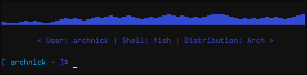

# nsplash
Nick's version of terminal ASCII art splash screen.

<br>

Very similar to `colorscript`. It just displays ASCII symbols and outputs some splash text and it looks pretty.

<br>

## Preview


<br>

## Usage
I made a config.py file where you can configure the program. I mainly did it for fun, you can modify the code by yourself too.

`splash_text` method inside `config.py` gets called by `nsplash.py` and outputs it after the ASCII "waves".

```Python
def splash_text() -> str:
    return "Hello, World!"
```

You can put any string as a return. You can import any Python library, for example `os` and use it to display username, shell or distribution.